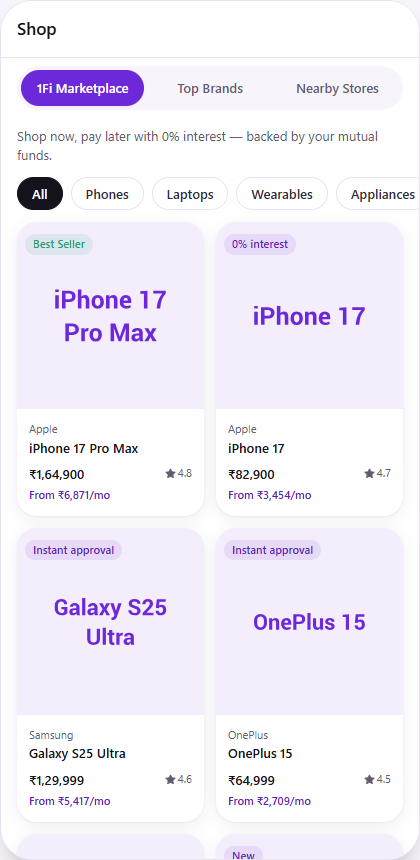
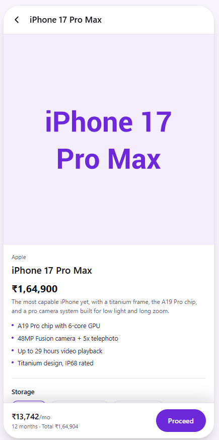
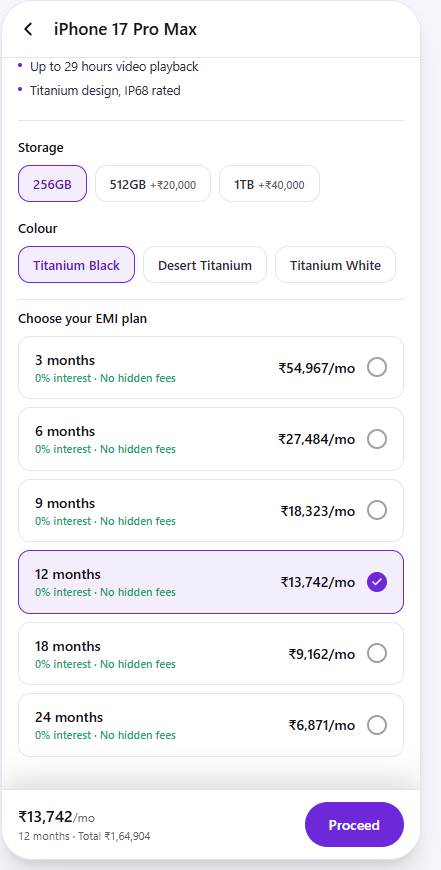

# 1Fi Marketplace — Shop Page

Implementation of the **1Fi Marketplace** section inside the Shop page, built for the 1Fi SDE Intern assignment.

## Screenshots

| Marketplace listing | Product detail | EMI plan selection |
|---|---|---|
|  |  |  |

Verified against the live 1Fi app's Shop page for layout, tab structure, and EMI flow before submitting. The production app additionally shows ads and a few other surfaces (banners, notifications) that sit outside this assignment's scope — those aren't part of the Marketplace section this document asks for.

## Product understanding

1Fi is a LAMF (loan-against-mutual-fund) shopping platform: users pledge mutual fund units to get a credit limit, then shop electronics on **0%-interest, no-cost EMI** for tenures up to 24 months — no CIBIL check, no downpayment, no foreclosure charges. That's the model this Marketplace section is built around:

- Real product line-up style (iPhone 17 / 17 Pro Max, Galaxy S25 Ultra, OnePlus 15, MacBook Pro, Watch Ultra 3) as the mock catalogue
- 1Fi's brand purple (`#6C28D9`) used throughout via Tailwind design tokens, not hardcoded per-component
- EMI tenures of 3/6/9/12/18/24 months, all 0% interest, matching 1Fi's real no-cost EMI positioning
- "Top Brands" and "Nearby Stores" are implemented as real (if intentionally blank) tabs — present in the navigation, not missing — since the spec asks for all three options to exist on the Shop page

## Structure

```
src/
  types/                 Domain types (Product, Variant, EmiPlan, ApiResult<T>)
  data/                  Mock catalogue + EMI tenure data (stands in for a backend)
  services/
    marketplaceApi.ts    The ONLY module that touches mock data.
                          Simulates network latency + ~6% random failure so
                          loading/error states are real, exercised paths —
                          not just markup. Swapping this for real endpoints
                          (fetch calls) is the entire migration to production.
  hooks/
    useProducts.ts        List fetch + loading/error/retry state
    useProductDetail.ts    Detail fetch + loading/error/retry state
    useEmiPlans.ts         Plan fetch + selected-plan EMI calculation
  utils/format.ts          Currency formatting + EMI math (reducing-balance
                            formula, degrades correctly to flat-division for
                            0%-interest plans)
  components/
    shop/                  ShopPage (tab shell), ShopTabs, the two placeholder tabs
    marketplace/           MarketplaceScreen (grid), ProductDetailScreen (PDP),
                            ProductCard, CategoryFilter, VariantSelector,
                            EmiPlanCard/Selector, PriceSummaryBar
    common/                TopBar, SkeletonCard, ErrorState, EmptyState, Badge
```

**Why this shape:** `services` is the single seam between UI and data. Nothing
in `components` or `hooks` imports `data/*.mock.ts` directly — they all go
through `marketplaceApi.ts`. That's the point of the "avoid hardcoding, allow
dynamic retrieval" requirement: pointing this at a real backend is a rewrite
of one file, not a hunt through every component for embedded arrays.

## Functionality implemented

- Shop page with the three required tabs (Marketplace / Top Brands / Nearby Stores)
- Product listing with image, name, brand, price, starting EMI, rating, category filter
- Product detail: gallery image, description, highlights, variant selection
  (storage/colour) that live-updates the price
- EMI plan selection (3/6/9/12/18/24 months), monthly amount computed per plan
  from the variant-adjusted price
- Sticky price summary bar + "Proceed" CTA with a confirmation sheet
- Loading skeletons and error states (with retry) for every async boundary:
  product list, product detail, and EMI plans load independently so a failure
  in one doesn't block the others
- Fully responsive (built mobile-first; the phone-frame in `App.tsx` is just
  a desktop preview shell — `ShopPage` itself has no fixed dimensions)

## Not implemented (intentionally, per spec)

- Top Brands, Nearby Stores — spec says these can remain blank
- Ads, banners, notifications, and other Shop-page chrome outside the
  Marketplace section — out of scope for this assignment
- Real checkout / pledging flow — out of scope; the "Proceed" CTA shows what
  the next step would be (eligibility check → pledge mutual funds) since that
  flow belongs to 1Fi's existing onboarding, not the Marketplace section

## Running it

```bash
npm install
npm run dev      # http://localhost:5173
npm run build    # type-checks + production build
```

## Tech stack

React + TypeScript + Tailwind CSS, built with Vite. No React Native/Flutter
internals were assumed since the assignment doesn't specify a stack and the
actual app's source isn't available — the component boundaries (screens /
reusable components / hooks / services) map directly onto a native port if
needed, since the hooks and services layer stay framework-agnostic.
